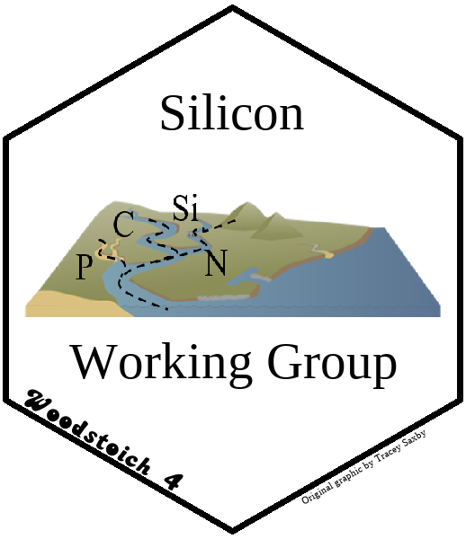

# Woodstoich 4 Silicon Working Group 

## The role of silicon in elemental ratios along a land-sea continuum

Silicon (Si) plays an important role in the growth of diatoms, aquatic plants, and macrophytes, such that its availability can significantly alter C:N:P ratios across several scales. Despite its importance, studies have largely overlooked the role of Si on elemental ratios, particularly in response to human-driven processes such as land-use change and agricultural run-off. Our objective is to  evaluate the relative importance of Si relative to C, N, and P stoichiometry along a land-sea continuum by 1) reviewing the current state of knowledge with regard to the importance of Si across systems, 2) exploring its influence on C:N:P stoichiometry under different conditions, and 3) highlighting areas where further research is needed. 

  - Team Members: 
   - Joanna Carey (Babson College) 
   - Lienne Sethna (Indiana Univeristy)
   - Patrick Thomas (University of Oldenburg) 
   - [Paul Julian](https://swampthing.github.io) (University of Florida)
   - [Kathi Jo Jankowski](https://www.usgs.gov/staff-profiles/kathi-jo-jankowski?qt-staff_profile_science_products=3#qt-staff_profile_science_products) (U.S. Geological Survey)

***
